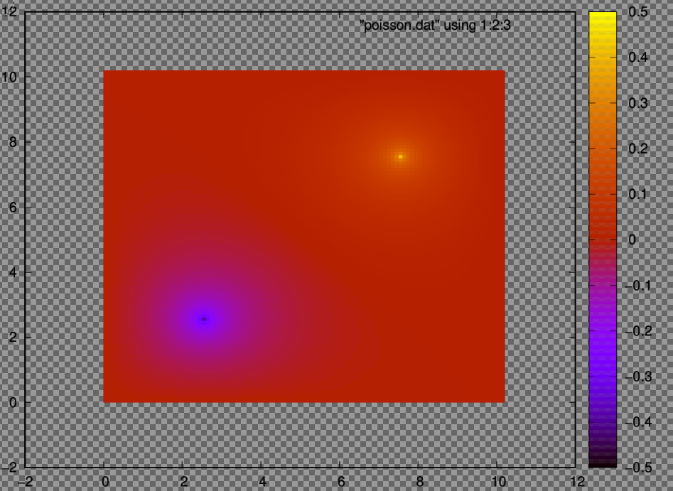
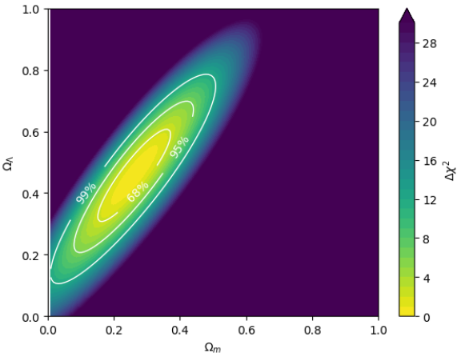

## Numerical Methods testing

This repository serves as a storage for numerical methods, PDE solvers, and algorithmic optimizations in lower-level settings before integrating them into larger systems. As these either solve common problems or are recreating results from published literature, they are compiled into one single repository.

The languages used are Fortran and Python. The context of the code is generally in a Physics/Astronomy setting. 

This README is structured as follows:

## Content
1. [Installation and Setup](#installation-and-setup)
2. [Poisson Problem](#poisson-problem)
3. [Cosmology](#Cosmology)
    * [Numerical integration to measure Luminosity distance](#numerical-integration-to-measure-luminosity-distance)
    * [Pantheon data set](#pantheon-data-set)
        * [Concepts Utilized](#concepts-utilized)
        * [Numerical Methods Employed](#numerical-methods-employed)
4. [Acknowledgements](#acknowledgements)
5. [References](#references)
6. [License](#license)


## Installation and Setup 

NOTE that these pipelines were compiled and ran in a WSL virtual environment; commands might differ in other versions.

The entire repository can be installed from the Github page:
`git clone https://github.com/GarforthAdam/numerical-methods`
`cd numerical_methods`

The distinct files are self-contained; each file can run start to finish on its own. However, ensure that a `Fortran` compiler is installed. It is recommended to use `gfortran`.

The individual files can be located through the filetree below:

```

/numerical_methods
|
|- /Electrostatics
|    |- poisson.f90
|    
|- /Cosmology
|   |- cosmological_methods.ipynb
|   |- cosmology_functions.py
|   |- Pantheon+SH0ES.dat (dataset required for analysis, from Scolnic, et al. (2021))
|
|- /assets
|   |- poisson_result.png
|   |- contour_plt.png
```

## Poisson Problem

The poisson problem solves the second order elliptic equation

$$\nabla ^2 \phi = f $$

, where $f$ is the known function the source term, and $\phi$ is the desired function.
In cartesian coordinates, this equation can be written as

$$ \frac{\partial ^2 \phi }{\partial x^2} + \frac{\partial ^2 \phi }{\partial y^2} + \frac{\partial ^2 \phi }{\partial z^2} = f(x,y,z)$$

Additionally, it is known that by setting $f = 0$, one obtains laplace's equation.

The code solves the 2D poisson problem in an electrostatic setting for a (10 cm x 10 cm) grounded conducting box with electric potential U=0 everywhere on the boundary. 

As this problem deals with individual point charges being placed in the box, the electrostatic poisson solution is employed using Gauss' law:

$$\nabla \cdot E = \frac{\rho_f}{\epsilon}$$

We assume the curl of the Electric field is 0 when there is no precense of the magnetic field. 

Thus, E is written as 

$$E = -\nabla \phi$$

, where $$\phi$$ is a scalar function representing the electric potential. The minus sign is introduced so the function corresponds with the electric potential energy per unit charge. 

As such, poissons equation in electrostatics becomes

$$\nabla^2 \phi = -\frac{\rho_f}{\epsilon}$$

This equation is solved using the finite difference method, replacing the integration with algebraic approximation across individual cells.

Fortran's advantage in this problem by being computationally efficient by defining separate grids for the initial charge distribution and a continuously changing potential estimate. Fortran allows for connected memory on arrays, being able to save previous and post iterations.

We define two distinct spherical charges at coordinates (25,25) and (75,75), as the box is defined to have 100 cells in each direction. As such the solution to the Poisson equation, denoted by $\nabla ^2 \phi = -\frac{\rho_f}{\epsilon}$ becomes 

By iterating over both directions on the grid, the solution is approximated using

$$u_{new}(x,y) = \frac{u(x+1,y) + u(x-1,y) + u(x,y+1) + u (x,y-1) + 4\pi H^2q(x,y)}{4} $$

, where $u_{new}(x,y) calculates the new potential at the desired grid point, $u(x\pm1, y\pm 1)$ gives the potential at the surrounding 4 grid points, H is the grid size, q(x,y) is the initial potential at the grid point.

The convergence point is defined as the point where the charge value is changed by $\geq 10^{-4}$. At this point the program will stop iterating and provide the results.

The final grid is saved to a GNUplot output and is viewable through gnuplot commands. 

This file can be run by first compiling:
`gfortran poisson.f90 -o output`

Then running `./output`

The result should look similar to the image below:



## Cosmological Methods

The entire cosmology pipeline can be ran through `cosmological_methods.ipynb`.

However, distinct methods within the file are elaborated on below:

### Numerical integration to measure Luminosity distance
Consider a universe with matter, cosmological constant (presence of dark energy), and potentially curvature. 

The comoving distance (a measurement factoring out universal expansion) can be defined as:

$$dC_{(z)} = d_H \int_0^z{dz \frac{1}{\sqrt{\Omega_M(1+z)^3 + \Omega_{\Lambda} + \Omega_k(1+z)^2}}}$$

where the curvature density (measurement of universe curvature) is:

$$\Omega_k = -\frac{\kappa c^2}{H_0^2R_0^2} = 1 - \Omega_M - \Omega_{\Lambda}$$

and $d_H = \frac{c}{H_0}$. This comoving distance equation is primarily derived from the Friedmann equations, a set of equations that describe cosmic expansion in homogenous and isotropic models of the universe within general relativity. As such, these definitions are made with the assumptions of:

- $c^2d\tau^2 = c^2dt^2 - dx^2 - dy^2 - dz^2$, that is, the Friedmann–Lemaître–Robertson–Walker metric, where a homogenous, isotropic, and expanding universe is path-connected, but does not need to be simply connected. As such, this metric is a definition to measure distances in the assumed universe through time t, and cartesian coordinates. 
- Einstein's equations for general relativity
- A perfect fluid, one that can ignore the fluid properties of viscosity and containing heat

The angular diameter distance (how far away an object is based on its physical/angular size) is:

$$d_A = \frac{1}{1+z}S_{\kappa}(d_C(z))$$

where $S_{\kappa}$ is defined as:

$$S_{\kappa} = 
\begin{cases} 
R_0\sin(\frac{r}{R_0}) & \text{if } \kappa = +1 \\
r & \text{if } \kappa = 0  \\
R_0\sinh(\frac{r}{R_0}) & \text{if } \kappa = -1
\end{cases}
$$

, where $R_0$ is the present day radius of curvature of the universe, and $r$ is the curvature at the desired redshift.

By using the relation for luminosity distance (distance measurements from the luminosity of the object):

$$d_L(z) = (1 + z)^2d_A(z)$$

we can plot the luminosity distance in units of Hubble distance ($\frac{d_L}{H_0}$) as a function of redshift using numerical quadrature. As redshift is a property of the universe cause by expansion, it can be used to estimate distance and age of the universe by measuring the change in redshift of an object. As such, the first numerical method present in the `cosmology_functions.ipynb` file is integration to plot this relation. The function is plotted with 5 values of $\Omega_M$ and $\Omega_\{Lambda}$:
- A universe similar to our own, $\Omega_M = 0.3$, $\Omega_{Lambda} = 0.7$
- A flat matter-only universe, $\Omega_M = 1$, $\Omega_{Lambda} = 0$
- A universe with only the cosmological constant, $\Omega_M = 0$, $\Omega_{\Lambda} = 1$
- A closed, matter-only universe, $\Omega_M = 2$, $\Omega_{\Lambda} = 0$
- An open, low-density universe, $\Omega_M = 0.1$, $\Omega_{\Lambda} = 0$

Then, using the plotted graph, one should be able to clearly identify the open, low density universe as similar to our own, where at redshift $z=1$, the fractional accuracy required to distinguish the two is  0.0585, reinforcing the need for precise measurements in cosmology.


### Pantheon data set

#### Concepts Utilized
The Pantheon+ data set described in Scolnic, et al. (2021) and the associated cosmological fits within Brout, et al. (2022) are used in conjunction with the previously described model to determine a $\chi^2$ fit for the universe. Additionally, a contour plot for the $\chi^2$ fit is created separately to determine the ideal values of the cosmological parameters to describe our universe. 

To accomplish this, the type 1a supernova data set is used. The `zCMB` and `m_b_corr` columns are used, giving the redshift of the supernova host galaxy in the CMB rest frame and apparent b-magnitude of the supernova. The uncertainties `zCMBERR` and `m_b_corr_err_DIAG` are used, where `m_b_corr_err_DIAG` uses only the uncorrelated part of the uncertainty, as uncertainties are typically corrected from observations sourced from multiple observatories. 

Using the previously defined equation for luminosity distance, the apparent magnitude m can be defined as:

$$m = 5\log\frac{d_L}{d_H} + 5\log\frac{d_H}{10 \ pc} + M$$

, where M is the absolute magnitude of the object. A simpler way to describe this is as 

$$m = f(\frac{d_L}{d_H}) + g(d_H, M)$$. 

The $\chi^2$ fit approximation, weighted by the uncertainties in the observed apparent magnitudes, is described as:

$$\chi^2 = \sum_i \frac{(m_i - m_{model}(z_i;\Omega_m,\Omega_{\Lambda,H_0,M}))^2}{\sigma_{m,i}^2} $$

where index i iterates over all supernova, $m_i$ is the corrected apparent magnitude, $z_i$ is the redshift, $\sigma_{m,i}$ is the uncertainty in the apparent magnitude, and $m_{model}(z_i;\Omega_m,\Omega_{\Lambda,H_0,M})$ is the apparent magnitude predicted by the cosmological model. This equation can also be described as:

$$\chi^2 = \sum_i \frac{(m_i - f(\frac{d_L(z_i)}{d_H};\Omega_m, \Omega_{\Lambda}) - C)^2 }{\sigma_{m,i}^2}$$

, where C represents the dependence on $H_0$ and M, but not on redshift, thus it is the same for every supernova. 
We must find the value of C that minimizes $\chi^2$, $\hat{C}$. As such, $\chi^2$ must be differentiated with respect to C:

$$\frac{\partial \chi^2}{\partial C}= 0 = \sum_i \frac{-2(m_i - f(\frac{d_L(z_i)}{d_H};\Omega_m, \Omega_{\Lambda})) - 2C}{\sigma_{m,i}^2}$$ 

$$\sum_i \frac{C}{\sigma_{m,i}^2} =  \sum_i \frac{(m_i - f(\frac{d_L(z_i)}{d_H};\Omega_m, \Omega_{\Lambda}))}{\sigma_{m,i}^2}$$

As C is a constant, it can be brought out of the summation, but as it now represents the minimized value we now denote it as $\hat{C}$:

$$\hat{C}\sum_i \frac{1}{\sigma_{m,i}^2} = \sum_i \frac{(m_i - f(\frac{d_L(z_i)}{d_H};\Omega_m, \Omega_{\Lambda}))}{\sigma_{m,i}^2}$$

And as such, 

$$\hat{C} = (\sum_i \frac{1}{\sigma_{m,i}^2})^{-1} \sum_i \frac{(m_i - f(\frac{d_L(z_i)}{d_H};\Omega_m, \Omega_{\Lambda}))}{\sigma_{m,i}^2}$$

Using this derived $\hat{C}$ value, we can represent $\chi^2$ as:

$$\chi^2 = \sum_i\frac{(m_i - f(\frac{d_L(z_i)}{d_H};\Omega_m, \Omega_{\Lambda}) - \hat{C})^2 }{\sigma_{m,i}^2}$$


#### Numerical Methods Employed

We use the derived $\chi^2$ equation to find the best fitting model for the Panthon+data, using the same cosmological parameters as before: 
- A universe similar to our own, $\Omega_M = 0.3$, $\Omega_{Lambda} = 0.7$
- A flat matter-only universe, $\Omega_M = 1$, $\Omega_{Lambda} = 0$
- A universe with only the cosmological constant, $\Omega_M = 0$, $\Omega_{\Lambda} = 1$
- A closed, matter-only universe, $\Omega_M = 2$, $\Omega_{\Lambda} = 0$
- An open, low-density universe, $\Omega_M = 0.1$, $\Omega_{\Lambda} = 0$

As such, $\hat{C}$ is computed initially using each value for the cosmological parameters. Then we compute the $\chi^2$ value from these values. We define separate functions for both the function $f$, returning the apparent magnitude dependent on the $S_{\kappa}$ value for each universe, as well as the $\hat{C}$ function.

Integration is calculated using the same function as previously used for the luminosity distance as a function of redshift. As such, 5*1701 calls of integration runs in 0.7 seconds. 

We find the following $\chi^2$ values:
- $\Omega_M = 0.3$, $\Omega_{\Lambda} = 0.7$: $\chi^2$ = 845
- $\Omega_M = 1$, $\Omega_{\Lambda} = 0$: $\chi^2$ = $1.43 \cdot 10^3$
- $\Omega_M = 0$, $\Omega_{\Lambda} = 1$: $\chi^2$ = $1.56 \cdot 10^3$
- $\Omega_M = 2$, $\Omega_{\Lambda} = 0$: $\chi^2$ = $2.44 \cdot 10^3$
- $\Omega_M = 0.1$, $\Omega_{\Lambda} = 0$: $\chi^2$ = 859

As such, we find the model universe best fitting the Pantheon+data is one mimicking our own, and the second best fitting as an open, low-density universe, matching the results found from the plot of luminosity distance as a function of redshift.

Additionally, to match the methods used in Brout, et al. (2022), a contour plot of $\chi^2$ plots is created to find the parameters best fitting the data from our universe. 

We find an optimization error in the initial model used when creating a contour plot; the integration function used is called twice for each point in a 255 x 256 grid (a symmetrical grid would synchronize $\Omega_{M}$ and $\Omega_{\Lambda}$), resulting in ~$2.0\cdot 10^8$ integrations. A revised model, that slices the integrand across an entire row, interpolating the integration to calculate every redshift for a constant at once. Cumulative sum saves the previous integration to save computation time and only compute the additional redshifts required (if cum[0] = 0, and cum[1] = slice(0 -> 1), cum[2] would compute slice(0 -> 1) + slice(1 -> 2), or cum[1] + slice(1 -> 2). Then cum[3] = cum[1] + cum[2] + slice(2 -> 3), and so on.) to allow for the amount of integrations to be reduced to ~$6.5 \cdot 10^4$, an improvement of a factor of $10^4$, and reducing time complexity from O(N) to O(1). This revised model ran for ~8.8 seconds as opposed to an indefinite amount of time. 

To confirm the different methods used to compute $\hat{C}$ match, both methods are tested for a model of $\Omega_{M} = \Omega_{\Lambda} = 0.5$, finding a difference of $-2.99 \cdot 10^{-6}$, which we consider to be a minimal difference. 

Regions are defined as a standard gaussian frame of 68\%($1\sigma$), 95\%($2\sigma$), and 99\%($3\sigma$). 
For a respective fixed $\Omega_{Lambda}$ or a fixed $\Omega_M$, we can find the regions of $1\sigma$ . The 68%, 95%, and 99% joint confidence regions are shown in the contour plot below, computed from $\Delta \chi^2 = \chi^2 - \chi^2_{min}$ relative to the best-fit point.




We can find the best fitting parameter as $\Omega_M = 0.26$, $\Omega_{\Lambda} = 0.457$, for a $\chi^2 = 824$. This is compared with the values Brout, et al. (2022) found as: $\Omega_M = 0.306 \pm 0.057$, $\Omega_{\Lambda} = 0.625 \pm 0.084$,. While are values are not within the paper's uncertainties to a reasonable extent, we can attribute this to the use of diagonal degeneracy `m_b_corr_err_DIAG` as opposed to the real Pantheon+ uncertainties which are calibrated against the full covariance treatment between different observations. 


## Acknowledgements

I'd like the acknowledge the professors and mentors who helped me work through these problems and ensured I had the materials to derive and solve the computational problems present. 

## References

Scolnic, D., “The Pantheon+ Analysis: The Full Data Set and Light-curve Release”, <i>The Astrophysical Journal</i>, vol. 938, no. 2, Art. no. 113, IOP, 2022. doi:10.3847/1538-4357/ac8b7a.

Brout, D., “The Pantheon+ Analysis: Cosmological Constraints”, <i>The Astrophysical Journal</i>, vol. 938, no. 2, Art. no. 110, IOP, 2022. doi:10.3847/1538-4357/ac8e04.

## License


All parts of this project fall under the Apache 2.0 license agreement. Should any distinct method used here be used or modified, a reference or credit is not required, but would be appreciated. 

For contact/additional inquiries, please contact
adamgarforth0@gmail.com

